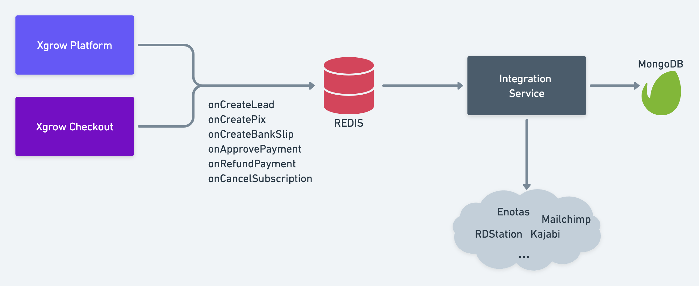

# Xgrow Integration Service

Este microserviço possui 3 responsabilidades:

  1. Consumir uma fila com mensagens de eventos provindos da Plataforma Xgrow e Checkout Xgrow;
  2. Lidar com essas mensagens a fim de respeitar as documentações das plataformas terceiras;
  3. Enviar essas mensagens para as plataformas terceiras, fazendo a integração entre Xgrow e serviços terceiros (Enotas, Mailchimp, Kajabi, e muitos outros).

Cada integração precisa obedecer a mais atual documentação das API's de cada serviço terceiro.

## Instalação

Primeiramente, crie seu arquivo .env utilizando o .env-example. Peça ao seu líder as informações atualizadas para que tenha acesso às tecnologias que estão sendo utilizados.

Então:

```shell
npm install
```

## Como utilizar

Se você estiver utilizando o Docker, simplesmente utilize:

```shell
docker-compose up
```

Este comando irá executar uma instância do MongoDB, Redis e do próprio serviço.

Da mesma forma, para parar todas estes serviços:

```shell
docker-compose down
```

Se preferir utilizar sem o Docker, precisa especificar no .env os endereços do MongoDB e Redis que irá utilizar.

### Build

Este comando constrói o que foi escrito em Typescript para Javascript no arquivo /dist.

```shell
npm run build
```

### Start

Este comando executa a aplicação construída em Javascript através do arquivo /dist/src/app.js

```shell
npm start
```

Atualmente, o que é executado neste momento é:

1. Conexão com o MongoDB;
2. Conexão com o Redis;
3. Execução do consumidor Bull.

### Contribuição

Para contribuir, por gentileza, utilize este template [Template de Pull-Request](./.github/PULL_REQUEST_TEMPLATE.md).
